# 🚀 Core.Fun - Hackathon Submission

> **Next-Gen Meme Token Platform Inspired by NeoBullX with Full Telegram Trading**

[](https://coredao.org/) [](https://github.com/Blockchain-Oracle/Core.Fun) [](https://t.me/core_dot_fun_bot)

## 💡 What We Built

**Core.Fun** - A complete DeFi ecosystem **inspired by NeoBullX's innovation**, bringing sophisticated meme token trading to **Core Blockchain**. What makes us unique: **Full Telegram bot integration** allowing users to trade, stake, and copy traders directly from chat without ever leaving Telegram.

**🤖 Try our Telegram Bot**: [@core_dot_fun_bot](https://t.me/core_dot_fun_bot)

```mermaid
graph LR
    A[🎨 Frontend] --> B[⚡ Smart Contracts]
    C[🤖 Telegram Bot] --> B
    B --> D[📊 Copy Trading]
    B --> E[🥩 Staking Tiers]
    
    style B fill:#feca57,stroke:#333,stroke-width:3px
    style D fill:#ff6b6b,stroke:#333,stroke-width:2px
    style E fill:#4ecdc4,stroke:#333,stroke-width:2px
```



## 🏆 Key Innovations

- **🔥 Bonding Curves**: Mathematical price discovery prevents rug pulls
- **🤝 Copy Trading**: Follow successful traders (1-10 slots based on staking tier)
- **🥩 Dynamic Staking**: Bronze → Platinum tiers with real benefits
- **🤖 Full Telegram Trading**: Complete DeFi in chat

## ⚡ Tech Stack


## 🎮 Live Demo

**Frontend**: [Core.Fun Platform](https://github.com/Blockchain-Oracle/Core.Fun)  
**Telegram Bot**: [@core_dot_fun_bot](https://t.me/core_dot_fun_bot)

### 🔗 Smart Contracts (Core Testnet)
| Contract | Address |
|----------|---------|
| **MemeFactory** | [`0x0eeF9597a9B231b398c29717e2ee89eF6962b784`](https://scan.test.btcs.network/address/0x0eeF9597a9B231b398c29717e2ee89eF6962b784) |
| **Staking** | [`0x3e3EeE193b0F4eae15b32B1Ee222B6B8dFC17ECa`](https://scan.test.btcs.network/address/0x3e3EeE193b0F4eae15b32B1Ee222B6B8dFC17ECa) |

```bash
# Quick Start
cd core.fun_Frontend && pnpm dev
# Visit: localhost:3000
```

## 🎯 Copy Trading Flow

```mermaid
sequenceDiagram
    User->>Bot: /copytrade 0x...ProTrader
    Bot->>Staking: Check Tier
    Staking-->>Bot: Gold (5 slots)
    Bot->>CopyEngine: Start Monitoring
    ProTrader->>Blockchain: Execute Trade
    Blockchain->>CopyEngine: Trade Event
    CopyEngine->>User: Copy Trade Executed ✅
```



## 📊 Results

| Metric | Achievement |
|--------|-------------|
| **Code** | 195 files, Full TypeScript |
| **Features** | Token creation, Copy trading, Staking |
| **Performance** | <100ms API, Real-time updates |
| **Security** | Anti-rug, Rate limiting, JWT auth |

---

**Contact**: [@BlockchainOracle_dev](https://t.me/BlockchainOracle_dev) | **Repo**: [Core.Fun](https://github.com/Blockchain-Oracle/Core.Fun)